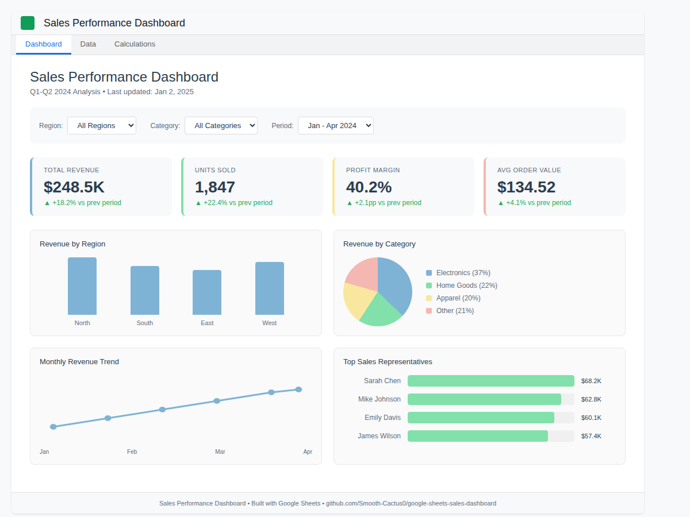

# 📊 Sales Performance Dashboard - Google Sheets

An interactive sales analytics dashboard built entirely in Google Sheets. Demonstrates advanced spreadsheet techniques including dynamic formulas, conditional formatting, and data visualization.



## 🎯 Features

- **Real-time KPI Cards** — Total Revenue, Units Sold, Profit Margin, Average Order Value
- **Interactive Filters** — Filter by Region, Product Category, or Date Range using dropdowns
- **Dynamic Charts** — Auto-updating visualizations based on filter selections
- **Sales Rep Leaderboard** — Ranked performance with sparklines
- **Trend Analysis** — Monthly revenue and growth tracking
- **Conditional Formatting** — Visual indicators for performance thresholds

## 📈 Dashboard Components

### KPI Summary Section
| Metric | Formula Technique |
|--------|------------------|
| Total Revenue | `SUMIFS` with filter criteria |
| Units Sold | `SUMIFS` with multiple conditions |
| Profit Margin | Calculated field with percentage formatting |
| Avg Order Value | `AVERAGEIFS` with dynamic range |

### Charts Included
1. **Revenue by Region** — Bar chart with pastel color scheme
2. **Category Distribution** — Pie/Donut chart  
3. **Monthly Trend** — Line chart with growth indicators
4. **Top Products** — Horizontal bar chart

### Advanced Formulas Used

```
// Dynamic filtered sum
=SUMIFS(Revenue, Region, $B$2, Category, $B$3)

// Percentage change calculation
=IFERROR((CurrentMonth-PreviousMonth)/PreviousMonth, 0)

// Conditional status indicator
=IF(B5>=Target,"✓ On Track",IF(B5>=Target*0.8,"⚠ Warning","✗ Behind"))

// Dynamic data validation for dropdowns
=UNIQUE(FILTER(Region, Region<>""))

// QUERY for aggregated views
=QUERY(Data!A:J, "SELECT B, SUM(H) GROUP BY B ORDER BY SUM(H) DESC LABEL SUM(H) 'Revenue'")
```

## 🛠️ Setup Instructions

### Step 1: Create New Google Sheet
1. Go to [sheets.google.com](https://sheets.google.com)
2. Create a new blank spreadsheet
3. Rename it "Sales Performance Dashboard"

### Step 2: Import Data
1. Create a sheet named `Data`
2. File → Import → Upload → Select `data/sales_data.csv`
3. Choose "Replace current sheet"

### Step 3: Create Dashboard Sheet
1. Create a new sheet named `Dashboard`
2. Follow the layout in `setup/dashboard_layout.md`
3. Copy formulas from `setup/formulas.md`

### Step 4: Add Charts
1. Select data ranges as specified
2. Insert → Chart
3. Configure chart types and colors per `setup/chart_config.md`

### Step 5: Apply Formatting
1. Apply conditional formatting rules from `setup/formatting_rules.md`
2. Set column widths and row heights
3. Add borders and background colors

## 📁 Repository Structure

```
├── README.md
├── data/
│   └── sales_data.csv          # Sample dataset (60 transactions)
├── setup/
│   ├── dashboard_layout.md     # Cell-by-cell layout guide
│   ├── formulas.md             # All formulas with explanations
│   ├── chart_config.md         # Chart setup instructions
│   └── formatting_rules.md     # Conditional formatting rules
└── screenshots/
    ├── dashboard_preview.png   # Main dashboard view
    ├── kpi_section.png         # KPI cards close-up
    └── charts_section.png      # Charts close-up
```

## 🎨 Design Specifications

### Color Palette (Pastel Theme)
| Element | Color | Hex Code |
|---------|-------|----------|
| Primary Blue | Soft Blue | `#7FB3D5` |
| Secondary Green | Soft Green | `#82E0AA` |
| Accent Coral | Soft Coral | `#F5B7B1` |
| Accent Yellow | Soft Yellow | `#F9E79F` |
| Background | Light Gray | `#F8F9F9` |
| Text Primary | Dark Slate | `#2C3E50` |

### Typography
- **Headers:** Bold, 14pt
- **KPI Values:** Bold, 24pt
- **Body Text:** Regular, 10pt

## 📊 Live Demo

**[View Live Dashboard](https://docs.google.com/spreadsheets/d/YOUR_SHEET_ID/view)** *(View Only)*

## 🔧 Customization

This template is designed to be easily customizable:

1. **Replace Data:** Swap `sales_data.csv` with your own data (maintain column structure)
2. **Add Regions:** Dropdown lists auto-populate from unique values
3. **Modify KPIs:** Edit formulas in the KPI section to track different metrics
4. **Restyle:** Change colors in Format → Alternating colors or chart settings

## 📚 Skills Demonstrated

- Advanced Google Sheets formulas (`SUMIFS`, `QUERY`, `ARRAYFORMULA`, `FILTER`)
- Data validation and dropdown menus
- Conditional formatting for visual indicators
- Chart creation and customization
- Dashboard layout and UX design
- Data organization best practices

## 📄 License

MIT License - Feel free to use as a template for your own projects.

---

**Created by [Alex]** | Data Analysis & Visualization Services

*Looking for custom dashboard development? [Contact me on Upwork](https://www.upwork.com/)*
